# TP 5 – Gestion de réservations avancée

## Objectifs

Requêtes avancées sur les salles avec JPA / Hibernate 5.6.5 et H2 (base en mémoire) :

1. **Salles disponibles par créneau** : requête JPQL avec sous-requête `NOT IN`
2. **Recherche multi-critères** : API Criteria (nom, capacité min/max, bâtiment, étage, équipement)
3. **Pagination** : `setFirstResult` / `setMaxResults` et classe `PaginationResult`

## Technologies

Java 8+ (testé avec JDK 21), Maven, Hibernate 5.6.5.Final (JPA 2.2), Hibernate Validator 6.2.0, H2 2.1.214, SLF4J 1.7.36, JUnit 4.13.2.

## Structure du projet

```
src/main/java/com/example
├── App.java                      # Classe principale (jeu de données + 3 tests)
├── model/                        # Utilisateur, Salle, Reservation, Equipement
├── repository/                   # SalleRepository + SalleRepositoryImpl
├── service/                      # SalleService + SalleServiceImpl
└── util/PaginationResult.java    # Résultat paginé
src/main/resources/META-INF/persistence.xml
```

## Lancer le projet

**IntelliJ IDEA :** File > Open > dossier contenant `pom.xml` > attendre l'import Maven > clic droit sur `App.java` > *Run 'App.main()'*.

**Ligne de commande :**

```
mvn clean compile exec:java
```

## Résultats (captures d'écran)

Les captures sont dans le dossier `screenshots/`.

### 1. Structure du projet

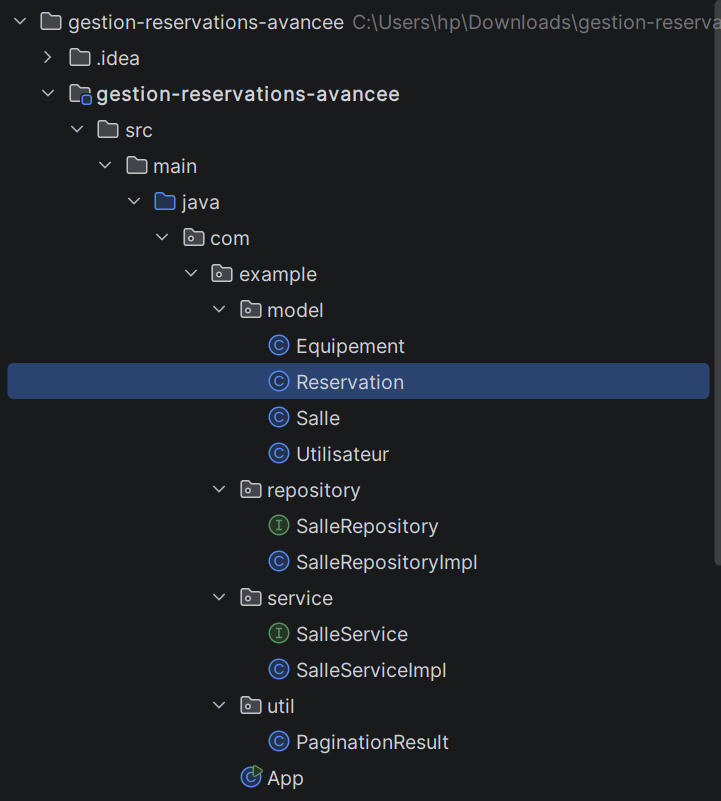

### 2. Génération du schéma par Hibernate

Tables `reservations` et `salle_equipement` :

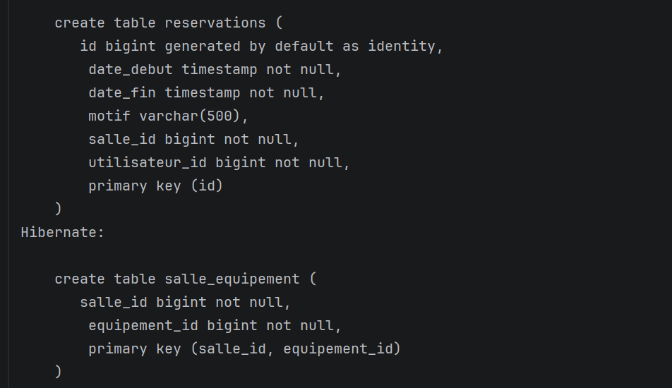

Tables `salles` et `utilisateurs` :

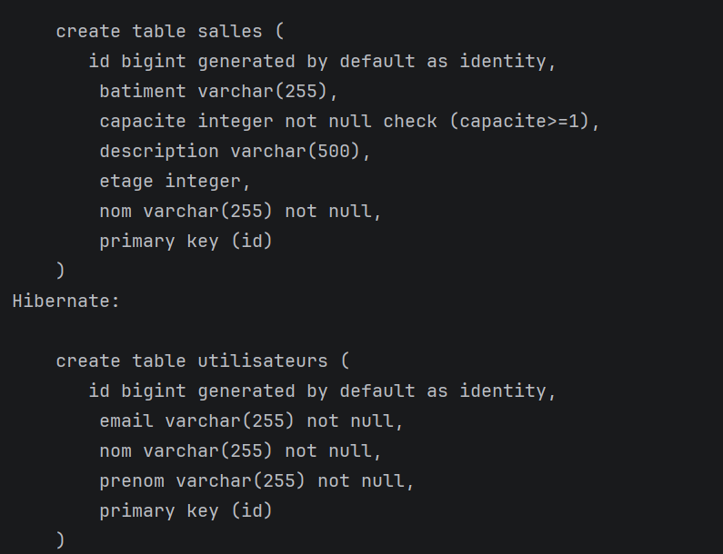

Contraintes (unicité de l'email, clés étrangères) :

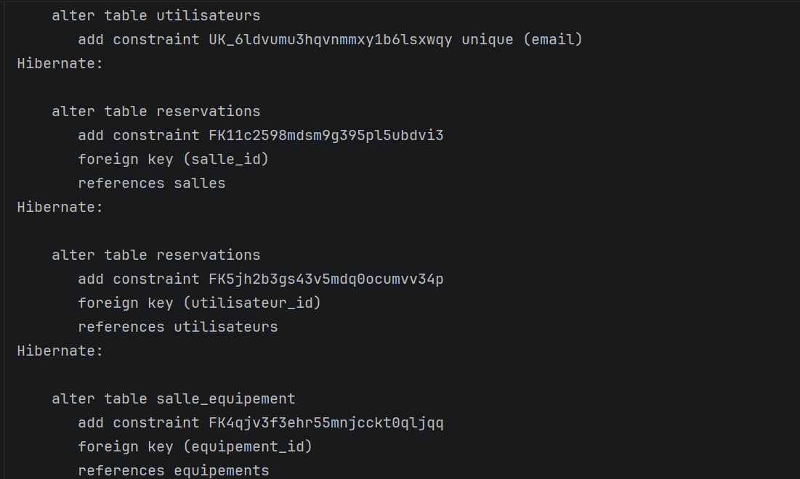

### 3. Initialisation des données de test

Insertion des équipements :

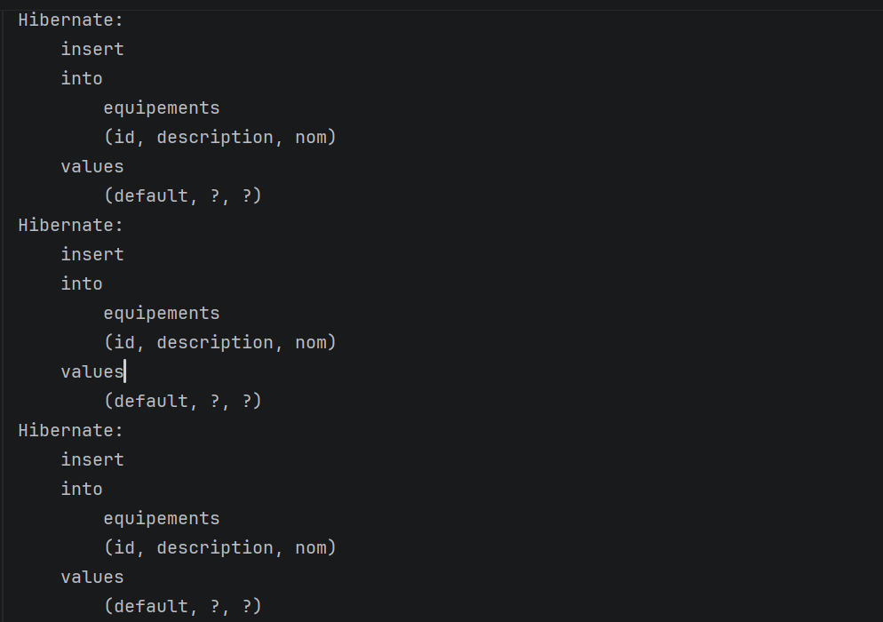

Insertion des liaisons salle/équipement et message de succès :

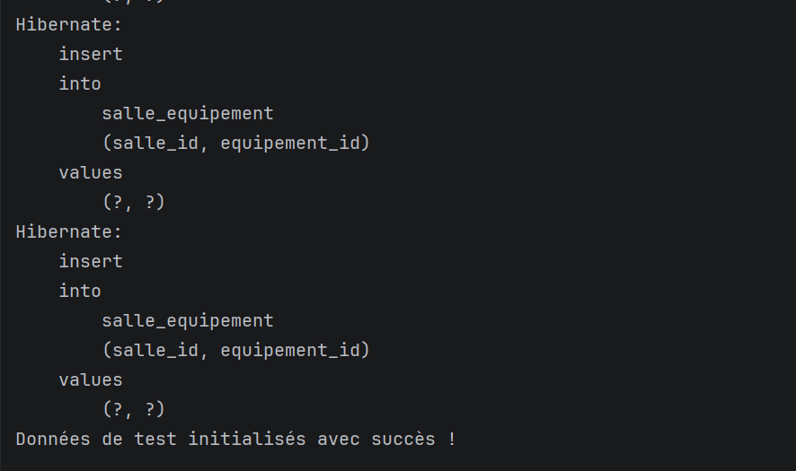

### 4. Test 1 : salles disponibles par créneau

Requête `NOT IN` générée pour le créneau du 06/10/2026 de 9h à 11h :

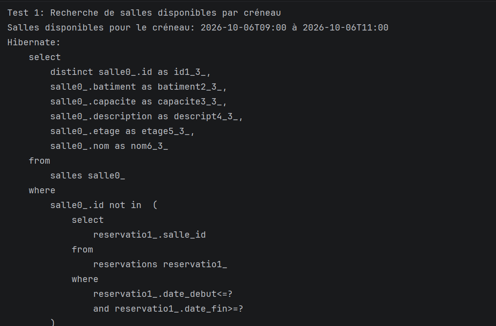

Résultat du premier créneau (la salle A1, déjà réservée, est exclue) et début du second créneau (10/10/2026, 14h à 16h) :

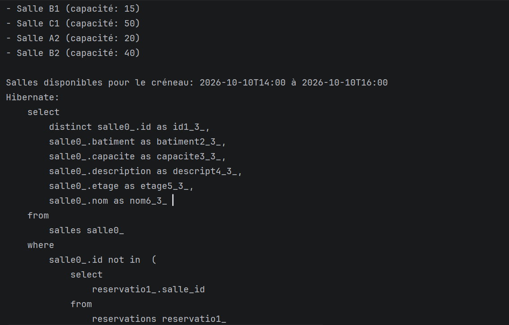

Résultat du second créneau : les 5 salles sont disponibles.

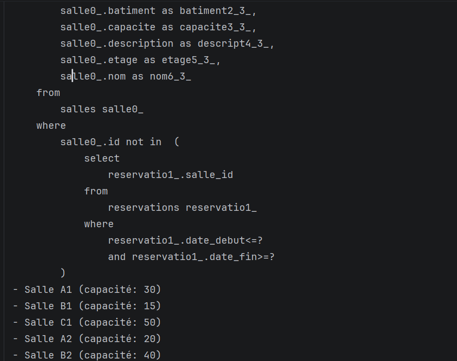

### 5. Test 2 : recherche multi-critères

Capacité >= 30 (Salle A1, Salle C1, Salle B2) :

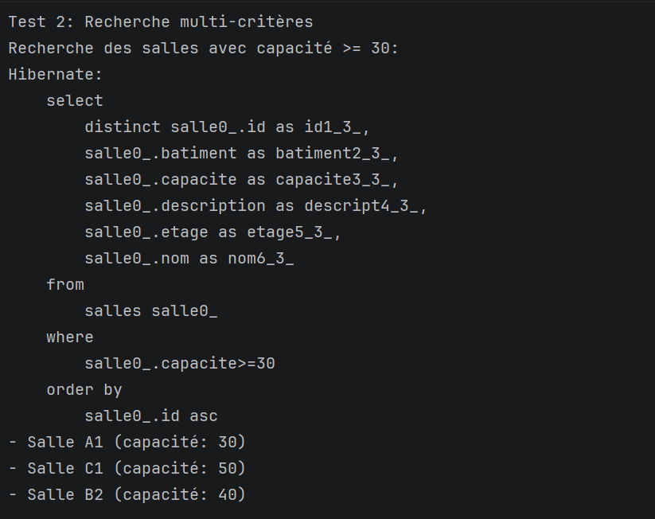

Capacité entre 20 et 40 à l'étage 2 (Salle A2) :

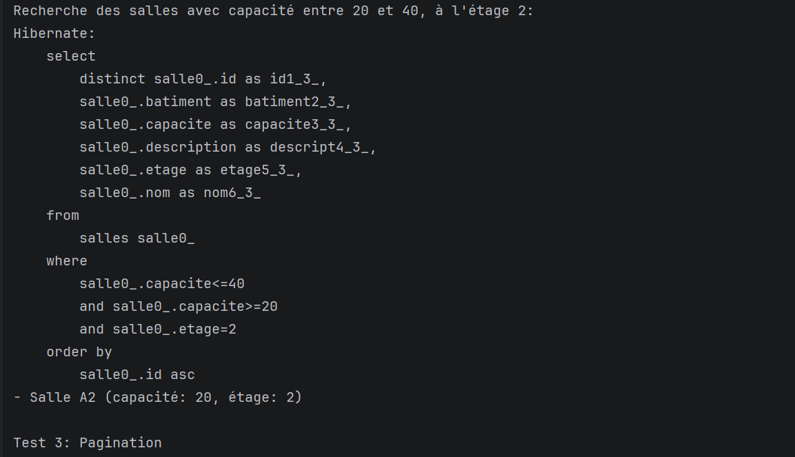

### 6. Test 3 : pagination

5 salles, 2 par page, donc 3 pages :

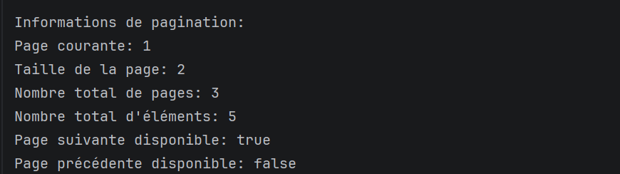

## Explication des concepts

- **Salles disponibles** : la requête sélectionne les salles dont l'id n'apparaît pas dans la liste des réservations qui chevauchent le créneau (`dateDebut <= fin AND dateFin >= début`).
- **Recherche multi-critères** : on construit dynamiquement une liste de `Predicate` avec `CriteriaBuilder`, un par critère fourni, puis on les combine avec `and`.
- **Pagination** : `setFirstResult((page - 1) * size)` et `setMaxResults(size)`, avec un `ORDER BY` pour un ordre stable. `PaginationResult` regroupe les éléments et les métadonnées (pages totales, page suivante/précédente).

**Auteur :** 
OUADAY SARA
